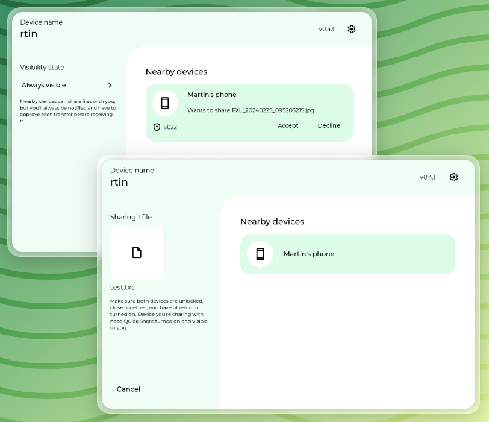

<div align="center">
  <h1>rquickshare</h1>

  <p>
    <strong>NearbyShare/QuickShare for Linux</strong>
  </p>
  <p>

[](https://github.com/Martichou/rquickshare/actions)
[](https://github.com/Martichou/rquickshare/actions)

  </p>
</div>



Installation
--------------------------

You simply have to download the latest release.
At the moment, only **Deb**, **Rpm** and **AppImage** are generated and supported.

#### Debian

```
sudo dpkg -i r-quick-share_${VERSION}_amd64.deb
```

#### RPM

```
sudo rpm -i r-quick-share-${VERSION}-1.x86_64.rpm
```

#### AppImage (no root required)

AppImage is a little different. There's no installation needed, you simply have to give it the executable permission (+x on a chmod) to run it.

```
chmod +x r-quick-share_${VERSION}_amd64.AppImage
```

You can then either double click on it, or run it from the cmd line:

```
./r-quick-share_${VERSION}_amd64.AppImage
```

#### Snap

The snap is not yet on the store, but you can install it with the following (you may need sudo).

```
snap install --dangerous r-quick-share_${VERSION}_amd64.snap
```

Limitations
--------------------------

- **Wi-Fi LAN only**. Your devices needs to be on the same network for this app to work.

FAQ
--------------------------

### My Android device doesn't see my laptop

Make sure both your devices are on the same WiFi network. mDNS communication should be allowed on the network; it may not be the case if you're on a public network (coffee shops, airports, ...).

### My laptop doesn't see my Android device

For some reason, Android doesn't broadcast it's mDNS service all the time; even when in "Everyone" mode.

As a workaround, you can use the "[Files](https://play.google.com/store/apps/details?id=com.google.android.apps.nbu.files)" app on your android device and go to "Nearby Share" tab (if it's not present, continue reading).

A second workaround, you can download a Shortcut maker (see [here](https://xdaforums.com/t/how-to-manually-create-a-homescreen-shortcut-to-a-known-unique-android-activity.4336833)) to create a shortcut to the particular intent:

- Method A:
	- Activity: `com.google.android.gms.nearby.sharing.ReceiveSurfaceActivity`

- Method B:
	- Action: `com.google.android.gms.RECEIVE_NEARBY`
	- Mime type: `*/*`

_Note: there's a current WIP to add a BLE advertisment in RQuickShare to overcome this._

### Once I close the app, it won't reopen

Make sure the app is really closed by running:
```
ps aux | grep r-quick-share
```
If you see that the process is still running, it's because the app is not closed. This may be an intended behavior: when closing the window, the app won't stop and instead is still running and accessible via the system tray icon. But if your distribution doesn't support/don't have enabled them, it may be an issue for you.

If you want to **really** close the app when clicking on the close button, you can change that inside the app by clicking on the three dots and then "Stop app on close".

### My firewall is blocking the connection

In this case, you may want to configure a static port to allow it in your firewall. You can do so by modifying the config file as follow:

```
rtin :: ~ » vim ./.local/share/dev.mandre.rquickshare/.settings.json

{
	...existing_config...,
	"port": 12345
}
```

By default the port is random (the OS will decide).

WIP Notes
--------------------------

`rquickshare` is still in development (WIP) and currently only supports Linux even tho it should be compatible with macOS too. Keep in mind that the design may change between versions, so flexibility is key.

Got feedback or suggestions? We'd love to hear them! Feel free to open an issue and share your thoughts.


Credits
--------------------------

This project wouldn't exist without those amazing open-source project:

- https://github.com/grishka/NearDrop
- https://github.com/vicr123/QNearbyShare


Contributing
--------------------------

Pull requests are welcome. For major changes, please open an issue first to discuss what you would like to change.
